# 🛠️ Migrador de Proyectos Fuse 2 a Quarkus 4

Este repositorio contiene un conjunto de scripts Python para automatizar la migración de proyectos Java basados en Apache Camel 2 (Fuse 2) hacia una arquitectura moderna con Quarkus 4 y Camel 4.

---

## 📦 Estructura General del Proceso

El sistema permite:

1. **Migrar un proyecto individual (`migrar_proyecto_completo.py`)**
2. **Migrar todos los proyectos dentro de una carpeta (`migrar_todos_los_proyectos.py`)**

---

## ▶️ Requisitos Previos

- Python 3.8+
- Maven instalado y accesible por consola (`mvn`)
- Estructura de proyectos Java válida (incluyendo `pom.xml`, `src/main/java`, `blueprint.xml`, etc.)
- Plantilla de `pom.xml` adaptada para Quarkus 4
- Archivo `application-global.properties` de Fuse 2

---

## 📁 Para Migrar Todos los Proyectos

Ejecuta el siguiente comando:

```bash
python migrar_todos_los_proyectos.py <carpeta_IN> <carpeta_OUT> <ruta_pom_template.xml> <ruta_application-global.properties> <aplicar_format (1|0)> <compilar (1|0)>
```

### 🔹 Parámetros:
- `<carpeta_IN>`: Ruta a la carpeta que contiene todos los proyectos originales a migrar.
- `<carpeta_OUT>`: Ruta donde se generarán los proyectos migrados.
- `<ruta_pom_template.xml>`: Ruta al archivo `pom.xml` base ya adaptado para Quarkus 4.
- `<ruta_application-global.properties>`: Ruta al archivo `.properties` global de Fuse 2, desde donde se extraerán variables relevantes.
- `<aplicar_format>`: Indica si se debe aplicar el formato con `google-java-format` (`1` para sí, `0` para no).
- `<compilar>`: Indica si se debe ejecutar `mvn compile` al final de la migración para validar que el proyecto compila (`1` para sí, `0` para no).

📌 **Ejemplo:**

```bash
python migrar_todos_los_proyectos.py ./IN ./OUT ./pom_template.xml ./application-global.properties 1 1
```

---

## 🧱 Módulos Ejecutados en el Proceso

1. `estructurar_proyecto_migrado.py`
2. `migrar_pom.py`
3. `migrar_clases_completas.py`
4. `convertir_blueprint.py`
5. `ajustar_root_routebuilder.py`
6. `ajustar_logger_trace.py`
7. `ajustar_singleton_properties.py`
8. `ajustar_jwt_context_filter.py`
9. `ajustar_metodos_consumer.py`
10. `ajustar_services_path.py`
11. `ajustar_anotaciones_metodos_service.py`
12. `ajustar_main_routebuilder.py`
13. `ajustar_services_llamada_camel.py`
14. `ajustar_clases_aggregation_strategy.py`
15. `ajustar_property_expression.py`
16. `ajustar_functions_util.py`
17. `generar_dockerfile.py`
18. `ajustar_application_properties.py`
19. `google_formatter.py` (opcional)

---

## 📈 Diagrama de Flujo del Proceso

```mermaid
graph TD
  A[Proyecto Fuse 2] -->|1| B[Estructurar Proyecto Migrado]
  B -->|2| C[Migrar pom.xml]
  C -->|3| D[Migrar Clases Java]
  D -->|4| E[Convertir blueprint.xml]
  E -->|5| F[Ajustar RootRouteBuilder]
  F -->|6| G[Ajustar LoggerTrace]
  G -->|7| H[Ajustar SingletonProperties]
  H -->|8| I[Ajustar JwtContextFilter]
  I -->|9| J[Ajustar ConsumerBean]
  J -->|10| K[Ajustar @Path Servicios]
  K -->|11| L[Ajustar Métodos REST]
  L -->|12| M[Ajustar MainRouteBuilder]
  M -->|13| N[Reemplazar return null]
  N -->|14| O[Ajustar AggregationStrategy]
  O -->|15| P[Ajustar Property Expressions]
  P -->|16| Q[Validar Functions.java]
  Q -->|17| R[Generar Dockerfile]
  R -->|18| S[Crear application.properties]
  S -->|19| T[Compilación Maven]
  T --> U[✅ Proyecto Migrado a Quarkus 4]
```



---

## 📝 Licencia

MIT
